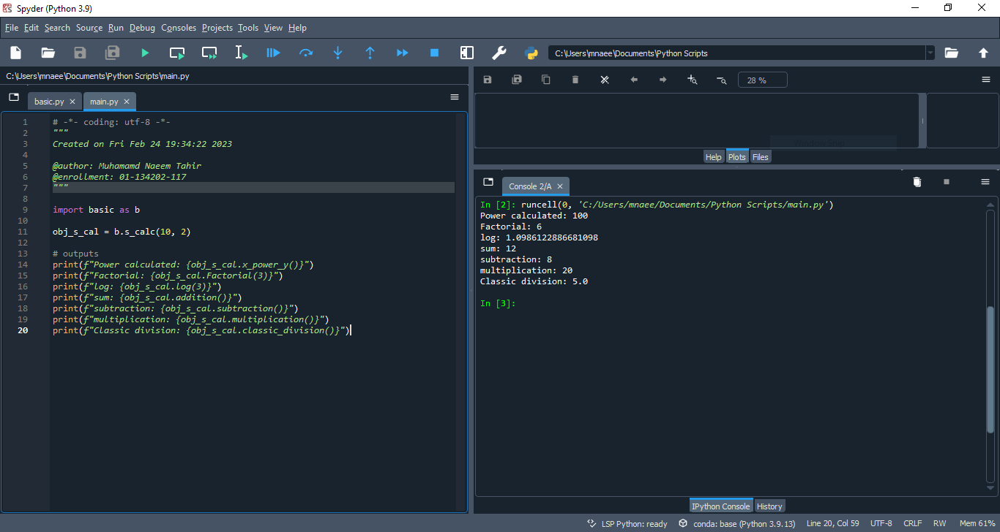

# AI Lab Journal 01

#### Muhammad Naeem Tahir
#### 01-134202-117
#### BSCS (6A) - Spring 2023

*Sweet reminder: I had completed bonus tasks during the lab and I was advised by you to remind in the journal submission.*

### Lab Journal Tasks 

**Task 01**


```python
x = int(input("Please enter an integer: "))
if x < 0:
    x = 0
    print('Negative changed to zero')
elif x == 0:
    print('Zero')
elif x == 1:
    print('Single')
else:
    print('More')
```

    Please enter an integer: -3
    Negative changed to zero
    

##### note

"IndentationError: expected an indented block"

- The above error occur during the execution when I pasted the code from the lab mannual. I made indentation changes (syntax correction) and I executed successfully.

- Also the input taken in the `x` variable was a string character that needed to be typecast using `int()` function. This could also be done using `ord()` function.

**Task 02**


```python
# Menu function
def Menu():
    choice = input("""
    Please enter your choice: 
    1. addition
    2. subtraction
    3. multiplication
    4. classic division
    5. Quit
    
    """)
    
    return choice

# addition function
Addition = lambda x, y: x+y

# subtraction function
Subtraction = lambda x, y: x-y

# multiplication function
Multiplication = lambda x, y: x*y

# classic division function
Classic_Division = lambda x, y: x/y

while True:       
    user_choice = int(Menu())
    
    if(user_choice == 5):
        print("Program terminated")
        break
    
    x = float(input("Please enter 1st number: "))
    y = float(input("Please enter 2nd number: "))
    
    
    if(user_choice == 1):
        print("Sum:",Addition(x,y))

    elif(user_choice == 2):
        print("Difference:",Subtraction(x,y))  

    elif(user_choice == 3):
        print("Product",Multiplication(x,y))
    
    elif(user_choice == 4):
        print("Quotient",Classic_Division(x, y))
```

    
        Please enter your choice: 
        1. addition
        2. subtraction
        3. multiplication
        4. classic division
        5. Quit
        
        1
    Please enter 1st number: 34
    Please enter 2nd number: 12
    Sum: 46.0
    
        Please enter your choice: 
        1. addition
        2. subtraction
        3. multiplication
        4. classic division
        5. Quit
        
        2
    Please enter 1st number: 5
    Please enter 2nd number: 1.2
    Difference: 3.8
    
        Please enter your choice: 
        1. addition
        2. subtraction
        3. multiplication
        4. classic division
        5. Quit
        
        3
    Please enter 1st number: 9.9
    Please enter 2nd number: 3.14
    Product 31.086000000000002
    
        Please enter your choice: 
        1. addition
        2. subtraction
        3. multiplication
        4. classic division
        5. Quit
        
        4
    Please enter 1st number: 100
    Please enter 2nd number: 5
    Quotient 20.0
    
        Please enter your choice: 
        1. addition
        2. subtraction
        3. multiplication
        4. classic division
        5. Quit
        
        5
    Program terminated
    

**Task 03**


```python
# Menu function
def Menu():
    choice = input("""
    Please enter your choice: 
    1. meter to kilometer
    2. kilometer to meter
    3. centimetre to meter
    4. centimeter to millimetre
    5. Quit
    
    """)
    
    return choice

# meter to kilometer function
MeterToKilometer = lambda x: x/1000

# meter to kilometer function
KilometerToMeter = lambda x: x*1000

# centimetre to meter function
CentimeterToMeter = lambda x: x/100

# centimetre to milimeter function
CentimeterToMilimeter = lambda x: x*10


while True:       
    user_choice = int(Menu())
    
    if(user_choice == 5):
        print("Program terminated")
        break
    
    x = float(input("Please enter a number: "))    
    
    if(user_choice == 1):
        print("Kilometers:",MeterToKilometer(x))

    elif(user_choice == 2):
        print("Meters:",KilometerToMeter(x))  

    elif(user_choice == 3):
        print("Meters",CentimeterToMeter(x))
    
    elif(user_choice == 4):
        print("Milimeters",CentimeterToMilimeter(x))
```

    
        Please enter your choice: 
        1. meter to kilometer
        2. kilometer to meter
        3. centimetre to meter
        4. centimeter to millimetre
        5. Quit
        
        1
    Please enter a number: 2
    Kilometers: 0.002
    
        Please enter your choice: 
        1. meter to kilometer
        2. kilometer to meter
        3. centimetre to meter
        4. centimeter to millimetre
        5. Quit
        
        2
    Please enter a number: 0.002
    Meters: 2.0
    
        Please enter your choice: 
        1. meter to kilometer
        2. kilometer to meter
        3. centimetre to meter
        4. centimeter to millimetre
        5. Quit
        
        3
    Please enter a number: 163
    Meters 1.63
    
        Please enter your choice: 
        1. meter to kilometer
        2. kilometer to meter
        3. centimetre to meter
        4. centimeter to millimetre
        5. Quit
        
        4
    Please enter a number: 85
    Milimeters 850.0
    
        Please enter your choice: 
        1. meter to kilometer
        2. kilometer to meter
        3. centimetre to meter
        4. centimeter to millimetre
        5. Quit
        
        5
    Program terminated
    

**Task 04**


```python
#import math library
import math as m


# base class => basic_calc
class basic_calc:
    def __init__(self, x=0, y=0):
        self.x = x
        self.y = y
        
    # addition function
    def addition(self):
        return self.x + self.y
    
    # subtraction function
    def subtraction(self):
        return self.x - self.y
    
    # multipliction function
    def multiplication(self):
        return self.x * self.y
    
    # division function
    def classic_division(self):
        return self.x / self.y
    
    
# inherited class => s_cacl    
class s_calc(basic_calc):
    def __init__(self, x=0, y=0):
        self.x = x
        self.y = y
        
    # factorial function    
    def Factorial(self, x):
        factorial = 1
        
        if(x == 0 and x == 1):
            return x
        elif(x < 0):
            print("Factorial of a negative number is not possible.")
            return
        else:
            for i in range(1, x+1):
                factorial = factorial * i
        
        return factorial
    
    
    # function to calculate power
    def x_power_y(self):
        return self.x ** self.y
    
    # function to calculate log
    def log(self, x):
        return m.log(x)
    
    
obj_s_cal = s_calc(10, 2)

# outputs
print(f"Power calculated: {obj_s_cal.x_power_y()}")
print(f"Factorial: {obj_s_cal.Factorial(3)}")
print(f"log: {obj_s_cal.log(3)}")
print(f"sum: {obj_s_cal.addition()}")
print(f"subtraction: {obj_s_cal.subtraction()}")
print(f"multiplication: {obj_s_cal.multiplication()}")
print(f"Classic division: {obj_s_cal.classic_division()}")
```

    Power calculated: 100
    Factorial: 6
    log: 1.0986122886681098
    sum: 12
    subtraction: 8
    multiplication: 20
    Classic division: 5.0
    

**Task 05**

- Importing modules task is done by using Spyder IDE


```python
# basic.py

# -*- coding: utf-8 -*-
"""
Created on Fri Feb 24 19:34:22 2023

@author: Muhamamd Naeem Tahir
@enrollment: 01-134202-117
"""

#import math library
import math as m


# base class => basic_calc
class basic_calc:
    def __init__(self, x=0, y=0):
        self.x = x
        self.y = y
        
    # addition function
    def addition(self):
        return self.x + self.y
    
    # subtraction function
    def subtraction(self):
        return self.x - self.y
    
    # multipliction function
    def multiplication(self):
        return self.x * self.y
    
    # division function
    def classic_division(self):
        return self.x / self.y
    
    
# inherited class => s_cacl    
class s_calc(basic_calc):
    def __init__(self, x=0, y=0):
        self.x = x
        self.y = y
        
    # factorial function    
    def Factorial(self, x):
        factorial = 1
        
        if(x == 0 and x == 1):
            return x
        elif(x < 0):
            print("Factorial of a negative number is not possible.")
            return
        else:
            for i in range(1, x+1):
                factorial = factorial * i
        
        return factorial
    
    
    # function to calculate power
    def x_power_y(self):
        return self.x ** self.y
    
    # function to calculate log
    def log(self, x):
        return m.log(x)
```


```python
# main.py

# -*- coding: utf-8 -*-
"""
Created on Fri Feb 24 19:34:22 2023

@author: Muhamamd Naeem Tahir
@enrollment: 01-134202-117
"""

import basic as b

obj_s_cal = b.s_calc(10, 2)

# outputs
print(f"Power calculated: {obj_s_cal.x_power_y()}")
print(f"Factorial: {obj_s_cal.Factorial(3)}")
print(f"log: {obj_s_cal.log(3)}")
print(f"sum: {obj_s_cal.addition()}")
print(f"subtraction: {obj_s_cal.subtraction()}")
print(f"multiplication: {obj_s_cal.multiplication()}")
print(f"Classic division: {obj_s_cal.classic_division()}")
```

    Power calculated: 100
    Factorial: 6
    log: 1.0986122886681098
    sum: 12
    subtraction: 8
    multiplication: 20
    Classic division: 5.0
    

**output (attached as screenshot)**



<center> <h1>The End</h1> </center>
